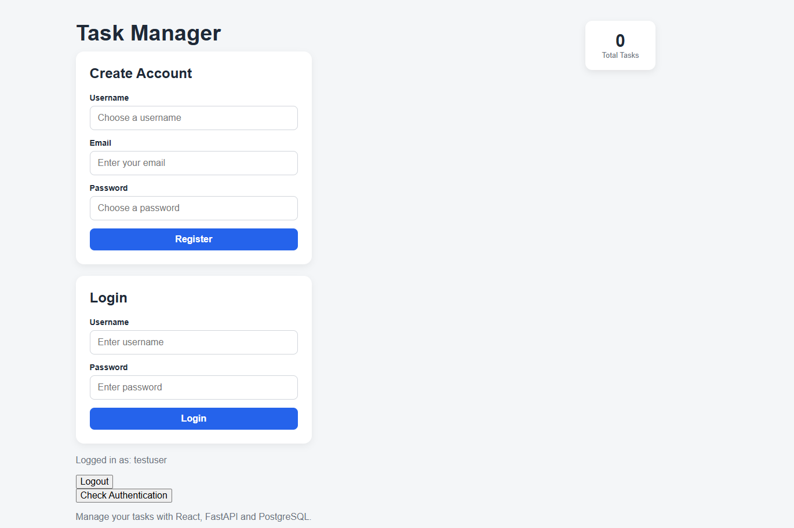
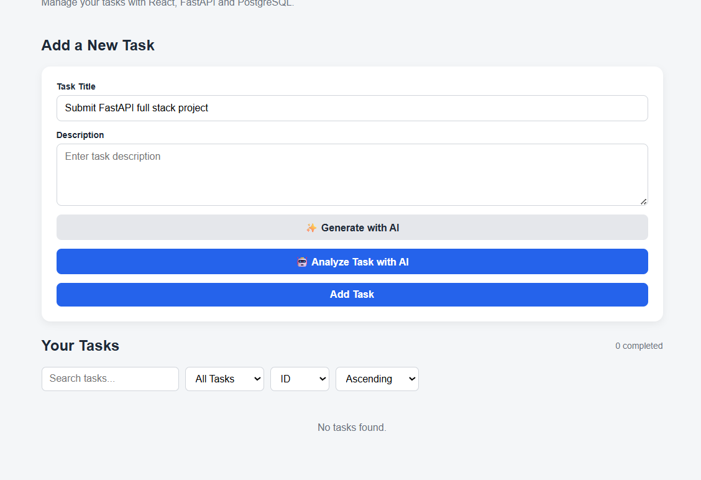
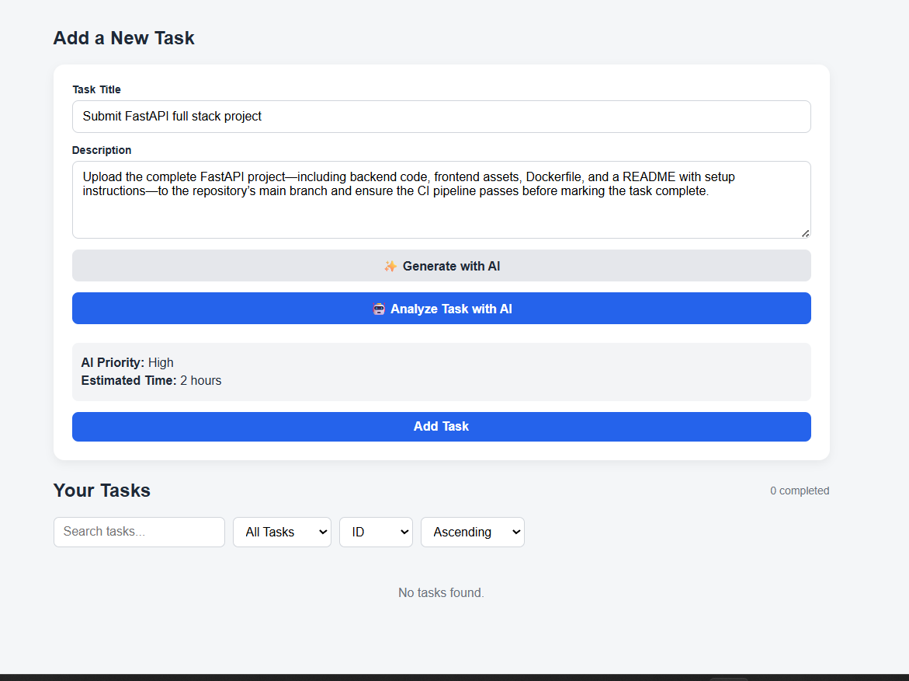
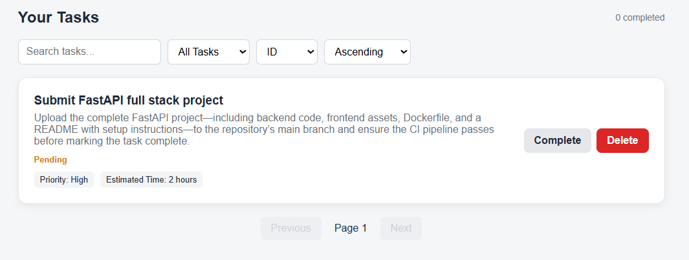
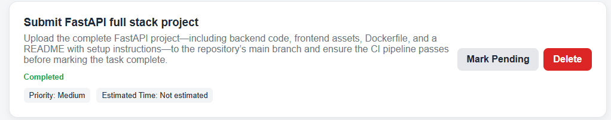

# Task Manager API + React Dashboard

A full-stack task management application built using FastAPI, PostgreSQL, and React, with JWT-based authentication and AI-powered task description generation and task analysis using Groq.

## Features

- User registration and login
- JWT-based authentication
- Password hashing using bcrypt
- Protected API endpoints
- Create tasks
- View all tasks
- View task by ID
- Update and edit tasks
- Mark tasks as completed or pending
- Delete tasks
- User-specific task management
- PostgreSQL database persistence
- React dashboard interface
- REST API architecture
- AI-powered task description generation
- AI-powered task priority suggestions
- AI-powered estimated completion time

## Screenshots

### Main Dashboard



### Add Task

Before using AI feature:



After using AI feature:



### Task List



After Completing Task:



## Tech Stack

### Backend

- Python
- FastAPI
- SQLAlchemy
- PostgreSQL
- Pydantic
- JWT
- Passlib / bcrypt
- Requests

### Frontend

- React
- Vite
- JavaScript
- CSS

### AI

- Groq API
- Groq-supported language model

## Architecture

```text
React Frontend
       ↓
FastAPI REST API
       ↓
Authentication + Business Logic
       ↓
SQLAlchemy ORM
       ↓
PostgreSQL Database
```

For AI-powered features:

```text
React Frontend
       ↓
FastAPI
       ↓
Groq API
       ↓
AI Model
```

## Production Architecture

```text
React Frontend
       ↓
     Vercel
       ↓
FastAPI Backend
       ↓
     Render
       ↓
 PostgreSQL

FastAPI Backend
       ↓
    Groq API
```

## Project Structure

```text
fastapi-task-manager/

│
├── app/
│   ├── main.py
│   ├── database.py
│   ├── db_models.py
│   ├── models.py
│   ├── auth.py
│   ├── ai.py
│   ├── routes/
│   │   ├── ai.py
│   │   ├── auth.py
│   │   ├── tasks.py
│   │   └── users.py
│   └── services/
│       ├── ai_service.py
│       └── task_service.py
│
├── frontend/
│   ├── src/
│   │   ├── components/
│   │   ├── App.jsx
│   │   ├── App.css
│   │   ├── index.css
│   │   └── main.jsx
│   └── package.json
│
├── requirements.txt
├── .gitignore
└── README.md
```

## Backend Setup

### 1. Create a virtual environment

```bash
python -m venv venv
```

### 2. Activate the virtual environment

Windows:

```bash
venv\Scripts\activate
```

### 3. Install Dependencies

```bash
pip install -r requirements.txt
```

### 4. Configure Environment Variables

Create a `.env` file and configure the required values.

```text
DATABASE_URL=your_postgresql_connection_string
SECRET_KEY=your_secret_key
GROQ_API_KEY=your_groq_api_key
```

Do not commit `.env` or API keys to GitHub.

### 5. Run the backend

```bash
uvicorn app.main:app --reload
```

Backend:

```text
http://127.0.0.1:8000
```

API documentation:

```text
http://127.0.0.1:8000/docs
```

## Frontend Setup

Go to the frontend directory:

```bash
cd frontend
```

Install dependencies:

```bash
npm install
```

Run the development server:

```bash
npm run dev
```

Frontend:

```text
http://localhost:5173
```

## Authentication

The application uses JWT authentication.

Users can:

- Register an account.
- Log in to receive a JWT token.
- Use the token to access protected endpoints.
- Manage only their own tasks.

The token is sent using the `Authorization` header:

```text
Authorization: Bearer <token>
```

## AI Integration

The Task Management System includes AI-powered task generation and analysis using the Groq API.

### AI Features

- AI-generated task descriptions
- Task priority suggestion
- Estimated task completion time
- AI-powered task analysis

### AI Workflow

For task analysis:

1. User enters a task title and description.
2. React sends the task information to FastAPI.
3. FastAPI sends a structured prompt to Groq.
4. The AI analyzes the task.
5. AI returns a priority and estimated completion time.
6. FastAPI returns the AI results to React.

For description generation:

1. User enters a task title.
2. React sends the title to FastAPI.
3. FastAPI sends a prompt to Groq.
4. The AI generates a task description.
5. FastAPI returns the generated description.
6. React displays the suggestion in the description field.
7. The user can edit the generated description before creating the task.

### AI Stack

- Groq API
- FastAPI
- React

## API Endpoints

### Authentication

| Method | Endpoint | Description |
| ------ | -------- | ----------- |
| POST | `/users` | Register a new user |
| POST | `/login` | Log in and receive a JWT token |
| GET | `/protected` | Test authenticated access |

### Tasks

| Method | Endpoint | Description |
| ------ | -------- | ----------- |
| POST | `/tasks` | Create a task |
| GET | `/tasks` | Get the user's tasks |
| GET | `/tasks/{id}` | Get a specific task |
| PUT | `/tasks/{id}` | Update a task |
| DELETE | `/tasks/{id}` | Delete a task |

### AI

| Method | Endpoint | Description |
| ------ | -------- | ----------- |
| POST | `/ai/suggest-description` | Generate an AI-powered task description |
| POST | `/ai/analyze-task` | Analyze task priority and estimated completion time |

### Testing

The API can be tested using the built-in FastAPI Swagger documentation:

```text
http://127.0.0.1:8000/docs
```

The React frontend can be used to test:

- User registration
- Login and logout
- Task creation
- AI description generation
- AI task analysis
- Task editing
- Task completion
- Task deletion

## Deployment

### Backend

Hosted on Render.

Backend URL:

### [Backend](https://fastapi-task-manager-x283.onrender.com/)


API Documentation:

[Docs](https://fastapi-task-manager-x283.onrender.com/docs)


### Frontend

Hosted on Vercel.

Frontend URL:

### [Frontend](https://fastapi-task-manager-sigma.vercel.app/)


## Future Improvements

- Add due dates, reminders, and notifications.
- Add automated unit and integration testing.
- Add more advanced AI-powered task suggestions.
- Improve task analytics and dashboard insights.
- Further improve mobile responsiveness.